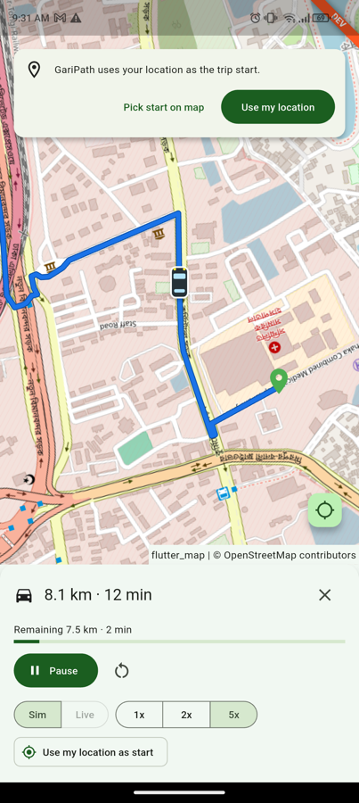
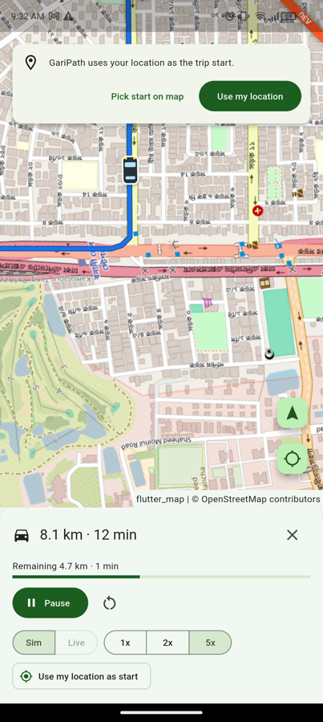
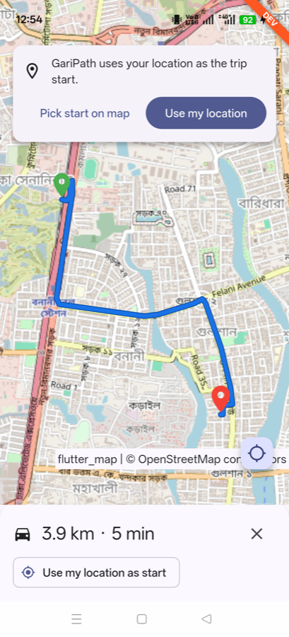
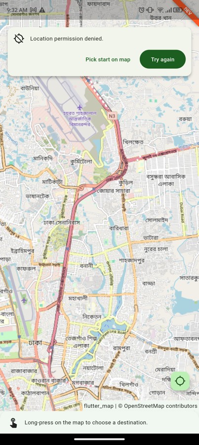
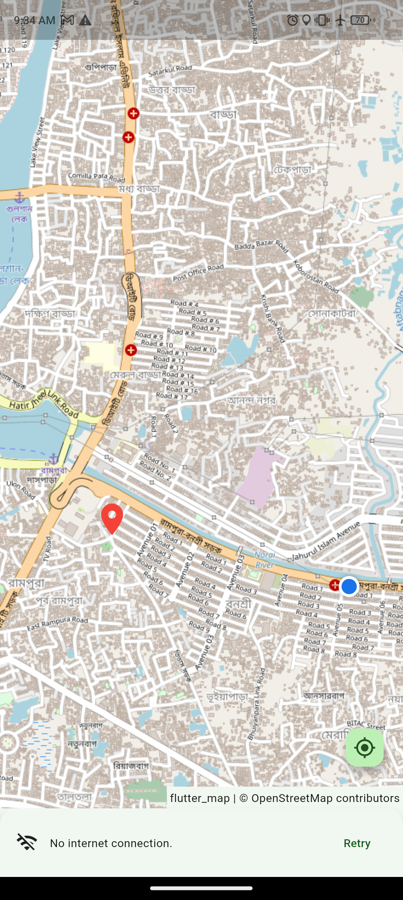
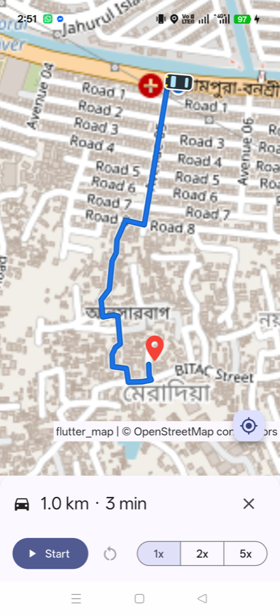
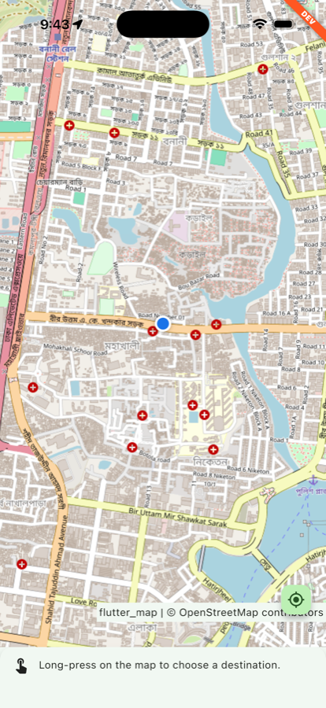
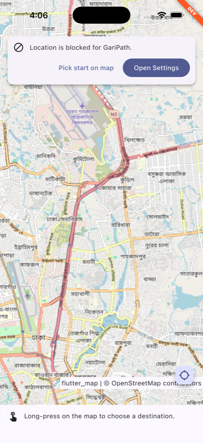

# GariPath

A single-screen Flutter app that gets the device location through **its own native code**, draws a driving route to a long-pressed destination, and animates a car along it at a constant speed. Built for the Garibook Senior Mobile Developer assessment.

| Driving at 5x | Camera follow + Recenter | No location? Pick a start |
|---|---|---|
|  |  |  |

Design notes: [DECISIONS.md](DECISIONS.md).

## Features

**Required (Android)**
- Native location in Kotlin (`FusedLocationProviderClient`): permission check and request, permanent-denial detection, services check, one-shot fix with timeout, live update stream. Exposed through a `MethodChannel` and an `EventChannel`. No location or permission plugins.
- Permission is only requested from a user tap, never at launch. Every state (denied, permanently denied, services off, timeout, approximate) has its own card and fixing action.
- Map: OpenStreetMap tiles with `flutter_map`, attribution always visible.
- Long-press a destination, and the app fetches a route from the public OSRM server. It shows the line, start and destination pins, total distance and OSRM's ETA, and fits the camera to the route.
- Requests are debounced (500 ms), never sent less than 1.1 s apart, stale answers are dropped, and HTTP 429 gets one automatic retry.
- Car animation: constant speed based on distance travelled, smooth shortest-way rotation, Start / Pause / Resume / Reset, 1x / 2x / 5x, live remaining distance and time.
- The camera follows the car. Dragging the map stops following and shows a Recenter button.
- Auto-pause when the app goes to the background, then resume with no jump.
- Two flavors, `dev` and `prod`: different app id, name, launcher icon and DEV banner. They can be installed side by side.

**Bonus**
- **iOS** native location in Swift (`CLLocationManager`) behind the same channels, with **no Dart changes**. Includes reduced-accuracy handling and `dev`/`prod` schemes. See [iOS](#ios).
- **Live GPS mode** (Sim | Live switch): the car follows the device's real position instead of the simulation. Fixes within 25 m of the route are **snapped onto the line**, and the car glides between fixes instead of jumping. Heading comes from the GPS bearing when moving, otherwise from the road direction. Remaining time uses OSRM's pace.
- **Navigation camera (rotation only):** while following, the map turns with the car so it always points up the screen. Showing my location, fitting a new route and Reset turn the map back to north up. Tilt is not implemented (see [DECISIONS.md](DECISIONS.md)).
- **Off-route reroute:** 3 accurate fixes in a row (accuracy ≤ 50 m) more than 50 m from the route trigger a new route from the current position to the same destination, then Live mode continues by itself. Reroutes are at least 30 s apart and go through the same debounce and rate limit.

## Requirements

| | Version |
|---|---|
| Flutter | 3.47.2 (stable) |
| Dart | 3.13.2 |
| Android | minSdk 24, target/compile SDK 36, JDK 17 |
| Google Play Services | Required: the brief asks for `FusedLocationProviderClient` |
| iOS | 15.0+, Xcode 26.1, CocoaPods 1.17 |

No API keys, secrets or local files are needed.

## Build and run

A flavor is **required**. Running without `--flavor` stops at startup with a clear message.

```bash
flutter pub get

# Android
flutter run --flavor dev
flutter run --flavor prod

flutter build apk --flavor dev --debug
flutter build apk --flavor prod --release   # signed with the debug key (see limitations)

# Tests and checks
flutter test
flutter analyze
bash tool/check_forbidden_deps.sh            # prints nothing when no forbidden plugin is used
```

| Flavor | Application id | App name | Extras |
|---|---|---|---|
| dev | `com.mosharof.garipath.dev` | GariPath Dev | DEV banner, orange launcher badge |
| prod | `com.mosharof.garipath` | GariPath | — |


## Flavor configuration

- **Native side:** `android/app/build.gradle.kts` defines `productFlavors` `dev` and `prod` (`applicationIdSuffix`, `resValue` app name). The dev icon lives in `android/app/src/dev/res`.
- **Dart side:** Flutter exposes the native flavor as `appFlavor`. `lib/config/config_resolver.dart` maps it to a typed, `const` `AppConfig`:
  - `lib/config/dev_config.dart`
  - `lib/config/prod_config.dart`

To point a flavor at another routing server, change one line in its config file:

```dart
const devConfig = AppConfig(
  ...
  osrmBaseUrl: 'https://routing.openstreetmap.de/routed-car',
  ...
);
```

## Packages

| Package | Version | Used for |
|---|---|---|
| get | 4.7.3 | State (`Rx`, `Obx`) and dependency injection (one binding) |
| flutter_map | 8.3.2 | OSM map, polyline and markers |
| latlong2 | 0.10.1 | `LatLng` type |
| dio | 5.11.1 | HTTP to OSRM (timeouts, cancellation) |
| logger | 2.8.0 | Readable logs |
| fake_async (dev) | 1.3.3 | Controlling timers in tests |
| flutter_lints (dev) | 6.0.0 | Lint rules |
| play-services-location (Android) | 21.4.0 | `FusedLocationProviderClient` |

## Services used (free, no key)

- **Tiles:** `tile.openstreetmap.org`. The app sends its application id as the User-Agent, as the OSM tile policy requires, and always shows "© OpenStreetMap contributors".
- **Routing:** `router.project-osrm.org` (public OSRM demo server). Requests are debounced, rate-limited to fewer than one per second, and send a descriptive User-Agent.

## Assumptions

The brief leaves some points open. These are the choices I made:

1. **Platforms:** Android and iOS are implemented. Any other platform reports "not supported" through the same channel contract. It doesn't crash, and the manual start still works.
2. **Packages:** only location and permission plugins are forbidden, so `get`, `dio`, `flutter_map` and `latlong2` are used.
3. **Speed:** the car drives at a fixed simulated **50 km/h × multiplier**. The route card shows OSRM's real-world ETA. The live "Remaining" time is based on the simulated speed, so it matches what you see and reacts to 1x/2x/5x.
4. **Start point:** the latest device fix, if it's under 2 minutes old when the destination is chosen. In Sim mode the route is not recomputed as the device moves; in Live mode it is, but only when the device leaves the route.
5. **No location** (denied, services off, indoors): the user can still pick a start point on the map. The app never blocks the core feature, and it never invents a silent default start.
6. **Approximate location** grants are accepted, with a banner offering precise location.
7. **Before the first fix**, the map is centred on Dhaka. The first fix times out after 15 s.
8. **Camera:** any drag or zoom gesture stops camera follow; the map keeps its current angle until Recenter, Start or Resume turn following (and heading-up rotation) back on. Two-finger rotation by the user is disabled, so the only map rotation is the camera's.
9. **New destination while driving:** the animation stops and a new route is fetched from the same start.
10. **Background:** the animation pauses and location updates stop while the app isn't visible. Both resume on return.
11. **Portrait only.**
12. **Both flavors** use the public OSRM server. Switching is a one-line config change (see above).
13. **Live mode** needs a device location, so the Live switch is disabled until there is one. The speed multiplier is disabled in Live mode. Switching mode stops the current trip. Live mode counts as arrived within 20 m of the destination.

## Known limitations

- The public OSRM demo server and OSM tile server are for light use only, not production traffic.
- No traffic-aware ETA. OSRM snaps the start and destination to the nearest road, so the car starts at the route's first point, which may be a few metres from the pin.
- No offline tiles: without internet the map turns grey. Routing shows a "No internet" message with Retry.
- No background location tracking, by design.
- Devices without Google Play Services are not supported.
- Inside one route segment, the position is interpolated linearly in latitude/longitude. The error is negligible at segment length.
- The release APK is signed with the debug key. There is no upload keystore in the repo.

| Permission denied | No internet | prod release build |
|---|---|---|
|  |  |  |

## iOS

The Swift code is in `ios/Runner/Location/`. It is the iOS twin of the Kotlin plugin, using the same channel names, payload keys and error codes, and it is registered in `AppDelegate.swift`.

```bash
cd ios && pod install && cd ..                # first time only
flutter run --flavor dev  -d <iphone-or-simulator>
flutter run --flavor prod -d <iphone-or-simulator>
flutter build ios --flavor prod --release     # needs your own signing team in Xcode
```

| Flavor | Scheme | Bundle id | Name |
|---|---|---|---|
| dev | `dev` | `com.mosharof.garipath.dev` | GariPath Dev |
| prod | `prod` | `com.mosharof.garipath` | GariPath |

Each scheme uses Flutter's flavored build configurations (`Debug-dev`, `Release-prod`, …). These set `PRODUCT_BUNDLE_IDENTIFIER` and `APP_DISPLAY_NAME`; `Info.plist` reads the display name. Both apps can be installed side by side.

iOS differences, mapped to the shared contract:
- iOS shows the permission dialog only once, so "Don't Allow" is reported as **permanently denied**, and the card offers Open Settings.
- iOS reports "denied" when Location Services are off for the whole device. That case is reported as **services disabled** instead.
- iOS has no public link to the Location Services screen, so "Open Location Settings" opens the app's Settings page.
- With approximate location, "Use precise location" asks for temporary full accuracy (`requestTemporaryFullAccuracyAuthorization`).

| Located (simulator) | Permission blocked |
|---|---|
|  |  |

## Project structure

```
lib/
  config/          AppConfig + dev/prod values, flavor resolver
  core/
    geo/           haversine, bearing, polyline decoder, RouteGeometry
    navigation/    RouteAnimator, LiveTracker, OffRouteDetector, HeadingSmoother,
                   NavigationFrame (pure Dart)
    util/          formatters, debouncer, rate-limit gate, cancel signal
  features/
    location/      channel service, typed errors, LocationController
    routing/       OSRM client and parser, RouteController
    navigation/    simulation clock (Ticker), NavigationController, MapCameraController
  presentation/    MapScreen, binding, widgets (cards, layers, car painter, controls)
android/app/src/main/kotlin/com/mosharof/garipath/location/
                   GariPathLocationPlugin, PermissionManager, CurrentLocationFetcher,
                   LocationStreamHandler, LocationMethodHandler
ios/Runner/Location/
                   GariPathLocationPlugin, LocationStreamHandler, LocationChannelContract
test/              unit and widget tests, hand-written fakes, OSRM fixtures
```
